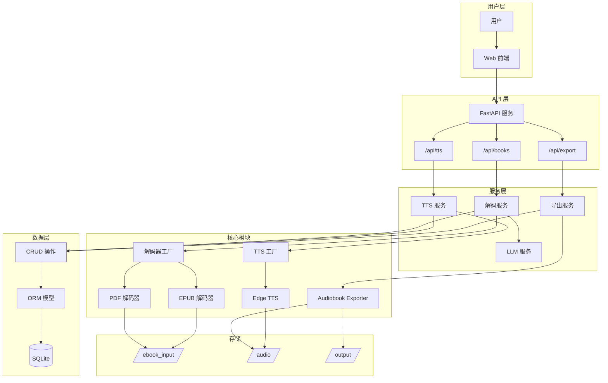
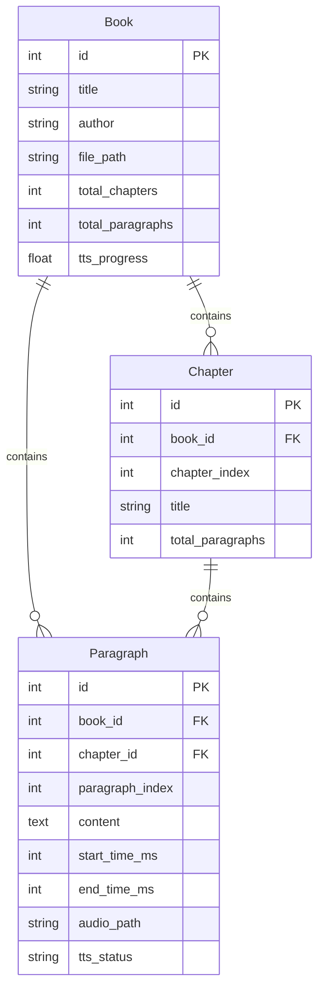

# VoiceBook 系统架构

VoiceBook 是一个智能有声书制作系统，将电子书(PDF/EPUB)转换为高质量有声书。

---

## 系统架构图



---

## 技术栈

| 层级 | 技术 | 说明 |
|:-----|:-----|:-----|
| **后端框架** | FastAPI | 高性能异步Web框架 |
| **数据库** | SQLite + SQLAlchemy | 轻量级持久化存储 |
| **TTS引擎** | Edge TTS | 微软语音合成服务 |
| **PDF解析** | PyMuPDF (fitz) | 高性能PDF解析 |
| **EPUB解析** | ebooklib + BeautifulSoup | EPUB内容提取 |
| **LLM集成** | OpenAI API (兼容) | 智能分章功能 |
| **前端** | Next.js | React服务端渲染 |

---

## 目录结构

```
voicebook/
├── app/                        # 后端应用核心
│   ├── main.py                 # FastAPI 入口
│   ├── config.py               # 配置管理
│   ├── database.py             # 数据库连接
│   ├── models.py               # ORM 模型定义
│   ├── schemas.py              # Pydantic 验证
│   ├── crud.py                 # 数据库操作
│   ├── routers/                # API 路由
│   │   ├── books.py            # 书籍管理
│   │   ├── tts.py              # 语音合成
│   │   └── export.py           # 有声书导出
│   └── services/               # 业务服务
│       ├── decoder.py          # 解码服务
│       ├── tts.py              # TTS服务
│       ├── llm_service.py      # LLM服务
│       ├── audiobook_exporter.py # 导出服务
│       └── tts_providers/      # TTS提供商
│           ├── base.py         # 抽象接口
│           └── edge.py         # Edge实现
│
├── ebook_decoder/              # 电子书解码模块
│   ├── base_decoder.py         # 解码器基类
│   ├── decoder_factory.py      # 工厂模式
│   ├── pdf_decoder.py          # PDF解码
│   ├── epub_decoder.py         # EPUB解码
│   └── models.py               # 解码器模型
│
├── frontend/                   # Next.js 前端
├── ebook_input/                # 电子书上传目录
├── audio/                      # 中间音频片段目录（段落级）
├── output/                     # 最终导出目录（章节级 WAV + LRC）
├── tests/                      # 测试文件
└── docs/                       # 项目文档
```

---

## 核心设计模式

### 1. 工厂模式 (Factory Pattern)

解码器使用工厂模式，根据文件扩展名自动选择解码器：

```python
# 使用示例
with DecoderFactory.create("book.epub") as decoder:
    paragraphs = decoder.decode_all_pages_concurrent(book_id=1)
```

**优势**: 新增格式只需实现 `BaseDecoder` 并注册即可。

### 2. Provider 模式

TTS服务通过Provider模式抽象引擎接口：

```python
class TTSProvider(ABC):
    @abstractmethod
    async def generate_audio(self, text: str, voice: str, output_path: str) -> bool:
        pass
```

**优势**: 可轻松切换或添加新的TTS引擎。

### 3. 分层架构

```
Router (路由) → Service (业务) → CRUD (数据) → Model (ORM)
```

**职责分离**: 每层专注单一职责，便于测试和维护。

---

## 数据模型



---

## 处理流程

### 电子书解析流程
1. 上传电子书 → 保存到 `ebook_input/`
2. 识别格式 → 选择解码器
3. 提取文本 → 分割段落
4. (可选) LLM智能分章
5. 存储到数据库

### TTS合成流程
1. 获取待合成段落 (status=pending)
2. 并发调用TTS引擎
3. 保存音频片段到 `audio/book_{id}/`
4. 更新段落音频信息

### 有声书导出流程
1. 获取已合成的段落音频
2. 按章节分组合并音频片段（WAV 格式）
3. 生成对应的 LRC 歌词文件（精确到毫秒）
4. 打包为 ZIP 供用户下载
