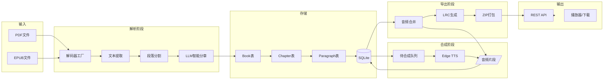
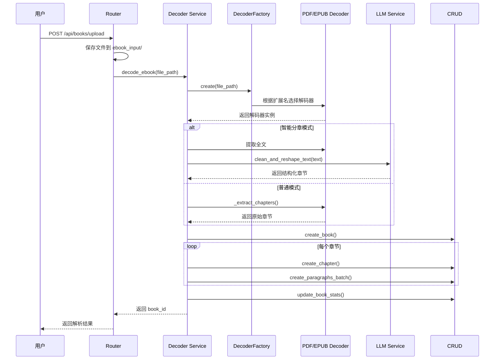
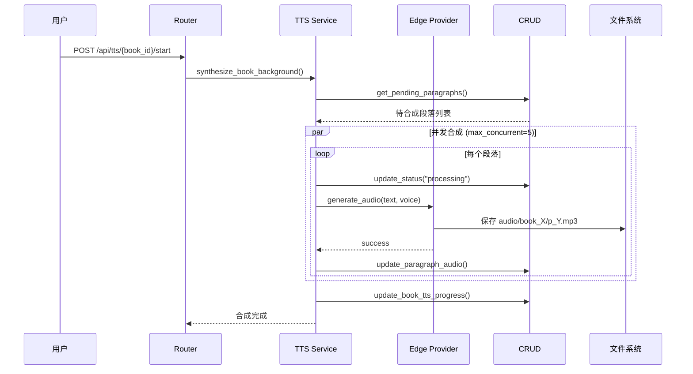
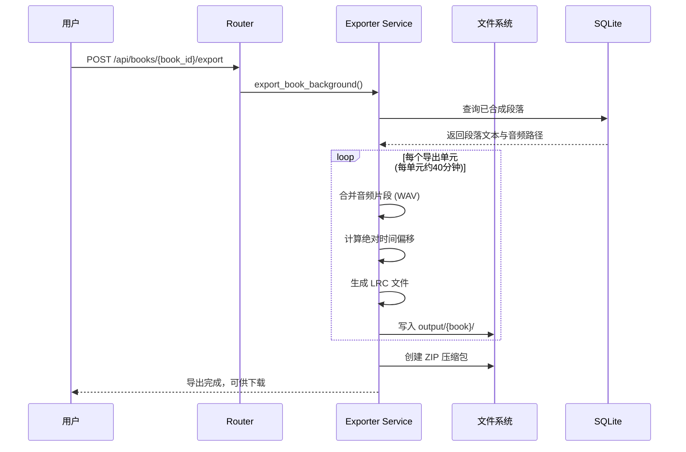
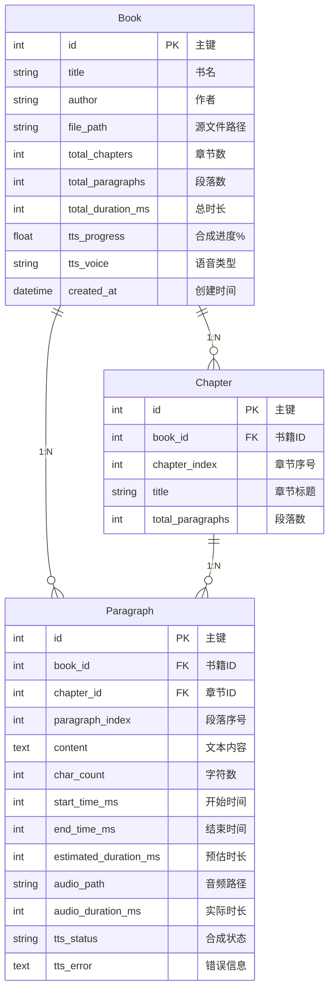
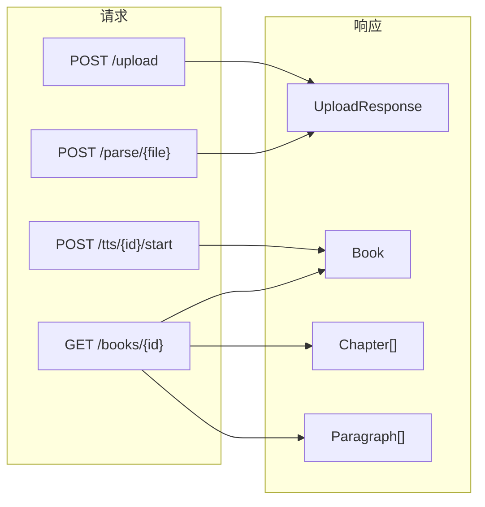

# VoiceBook 数据流

本文档描述系统的核心数据处理流程。

---

## 整体数据流



---

## 电子书解析流程

### 流程图



### 数据转换

```
原始文件 → 解码器提取 → 段落分割 → LLM清洗 → 数据库存储
   ↓           ↓            ↓          ↓           ↓
 PDF/EPUB   原始文本     段落列表    章节结构   Book/Chapter/Paragraph
```

---

## TTS 合成流程

### 流程图



### 状态变化

```
pending → processing → completed
                  ↘→ failed (错误)
```

---

## 有声书导出流程 (New)

### 流程图



---

## 数据模型关系



---

## API 数据流


