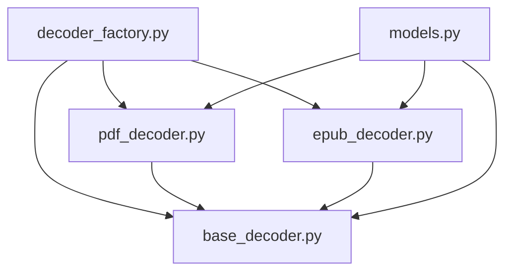

# VoiceBook 模块说明

本文档详细描述各模块的职责、接口和依赖关系。

---

## 模块总览

| 模块 | 路径 | 职责 |
|:-----|:-----|:-----|
| **app** | `app/` | FastAPI 后端应用 |
| **ebook_decoder** | `ebook_decoder/` | 电子书解码 |
| **frontend** | `frontend/` | Next.js 前端 |

---

## 1. App 模块

### 1.1 入口 (main.py)

```python
# 应用初始化
app = FastAPI(title="🎙️ 有声书制作系统", version="2.1.0")

# 路由注册
app.include_router(books.router)   # /api/books
app.include_router(tts.router)     # /api/tts
app.include_router(export.router)  # /api/export
```

### 1.2 路由层 (routers/)

#### books.py - 书籍管理
| 端点 | 方法 | 功能 |
|:-----|:-----|:-----|
| `/api/books/upload` | POST | 上传并解析电子书 |
| `/api/books/parse/{filename}` | POST | 解析已存在的文件 |
| `/api/books/files` | GET | 列出可解析的文件 |
| `/api/books` | GET | 获取书籍列表 |
| `/api/books/{id}` | GET | 获取书籍详情 |
| `/api/books/{id}` | DELETE | 删除书籍 |
| `/api/books/{id}/chapters` | GET | 获取章节列表 |
| `/api/books/{id}/paragraphs` | GET | 获取段落列表 |

#### tts.py - TTS 合成
| 端点 | 方法 | 功能 |
|:-----|:-----|:-----|
| `/api/voices` | GET | 获取可用语音列表 |
| `/api/tts/{book_id}/start` | POST | 启动后台合成任务 |

#### export.py - 有声书导出
| 端点 | 方法 | 功能 |
|:-----|:-----|:-----|
| `/api/books/{book_id}/export` | POST | 导出书籍为 WAV + LRC (后台) |
| `/api/books/{book_id}/export/sync` | POST | 同步导出 (等待完成) |
| `/api/books/{book_id}/export/download` | GET | 下载 ZIP 压缩包 |
| `/api/books/{book_id}/export/files` | GET | 获取导出文件列表 |

#### 静态文件访问
| 路径 | 描述 |
|:-----|:-----|
| `/outputs/{filename}` | 访问导出的最终文件 (WAV/LRC/ZIP) |

### 1.3 服务层 (services/)

#### decoder.py - 解码服务
```python
def decode_ebook(db: Session, file_path: str) -> Tuple[int, str]:
    """解码电子书并存入数据库"""
    
def _extract_chapters(decoder) -> List[Dict]:
    """普通模式：提取章节"""
    
def _smart_extract_chapters(decoder) -> List[Dict]:
    """智能模式：LLM分章"""
```

#### tts.py - TTS 服务
```python
async def synthesize_paragraph(db, paragraph, voice, provider) -> bool:
    """合成单个段落"""
    
async def synthesize_book(db, book_id, voice, max_concurrent) -> dict:
    """并发合成整本书"""
    
def synthesize_book_background(book_id, voice, max_concurrent):
    """后台任务：独立Session，适合BackgroundTasks"""
```

#### llm_service.py - LLM 服务
```python
class LLMClient:
    def clean_and_reshape_text(self, text: str) -> List[Dict]:
        """调用LLM清洗文本并重组章节"""
```

#### audiobook_exporter.py - 导出服务
```python
def export_book(db: Session, book_id: int) -> dict:
    """按章节合并音频并生成 LRC"""

def export_book_background(book_id: int):
    """后台导出任务"""

def create_zip_archive(book_title: str) -> Path:
    """将导出目录打包为 ZIP"""
```

### 1.5 全局实用工具 (utils/) (v2.1 新增)

为了提高代码复用性，通用的非业务逻辑被提取到 `app/utils` 包中：

- **audio.py**: 处理音频时长获取 (`get_audio_duration`) 和音频分段合并 (`merge_audio_to_wav`)。
- **text.py**: 提供文本清洗 (`clean_text_for_tts`)、文件名脱敏 (`sanitize_filename`) 及句子分割 (`split_to_sentences`)。
- **files.py**: 负责目录路径管理 (`get_export_dir`)、ZIP 归档 (`create_zip_archive`) 及冗余文件清理。

---

## 2. Ebook Decoder 模块

### 2.1 抽象基类 (base_decoder.py)

```python
class BaseDecoder(ABC):
    """所有解码器的抽象基类"""
    
    @abstractmethod
    def get_page_count(self) -> int:
        """获取页数/章节数"""
    
    @abstractmethod
    def decode_page(self, page_num: int, book_id: int) -> List[Paragraph]:
        """解码单页/章节"""
    
    @abstractmethod
    def decode_all_pages_concurrent(self, book_id, max_workers) -> List[Paragraph]:
        """并发解码全部"""
    
    def split_into_paragraphs(self, text: str, min_length: int) -> List[str]:
        """段落分割（通用实现）"""
```

### 2.2 工厂 (decoder_factory.py)

```python
class DecoderFactory:
    _decoders = {}  # 格式 -> 解码器类 映射
    
    @classmethod
    def register(cls, extension: str, decoder_class: Type[BaseDecoder]):
        """注册解码器"""
    
    @classmethod
    def create(cls, file_path: str) -> BaseDecoder:
        """根据文件类型创建解码器"""
```

### 2.3 具体实现

#### PDFDecoder (pdf_decoder.py)
- 使用 PyMuPDF (fitz) 解析
- 按页提取文本
- 支持并发解码

#### EPUBDecoder (epub_decoder.py)
- 使用 ebooklib + BeautifulSoup
- 按章节提取文本
- 移除HTML标签

### 2.4 模块依赖图



---

## 3. TTS Providers 模块

### 3.1 抽象接口 (tts_providers/base.py)

```python
class TTSProvider(ABC):
    @abstractmethod
    def get_voices(self) -> List[Dict]:
        """获取可用语音"""
    
    @abstractmethod
    async def generate_audio(self, text, voice, output_path) -> Tuple[bool, Optional[List[dict]]]:
        """
        生成音频文件并返回时间戳
        
        Returns:
            (success, timings): 
            timings 为字典列表，包含 {'text': str, 'offset': int, 'duration': int}
        """
```

### 3.2 Edge TTS 实现 (tts_providers/edge.py)

```python
class EdgeTTSProvider(TTSProvider):
    """Microsoft Edge TTS 实现"""
    
    def get_voices(self) -> List[Dict]:
        # 返回中文语音列表
        
    async def generate_audio(self, text, voice, output_path) -> Tuple[bool, Optional[List[dict]]]:
        """
        调用 edge-tts 生成音频
        - 实时监听 WordBoundary 事件捕获高精度时间戳
        - 解决 Python 3.14 兼容性问题
        """
```

---

## 4. 扩展点

### 添加新的电子书格式
1. 创建 `mobi_decoder.py`，继承 `BaseDecoder`
2. 实现抽象方法
3. 在 `decoder_factory.py` 中注册

### 添加新的 TTS 引擎
1. 创建 `azure_provider.py`，继承 `TTSProvider`
2. 实现抽象方法
3. 在 `TTSFactory` 中添加配置
